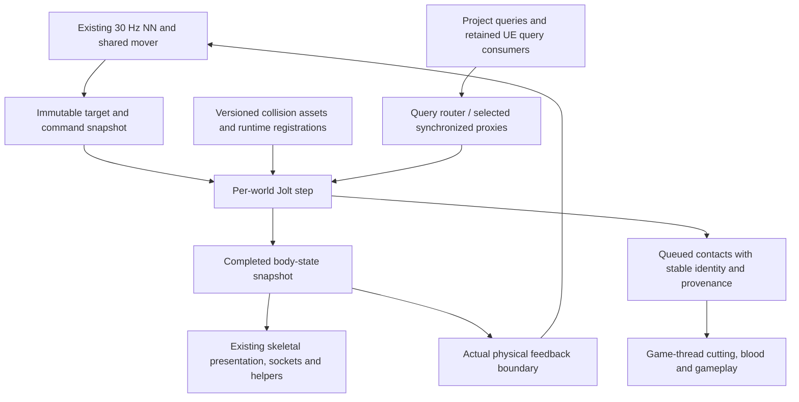

# Prophecy Jolt Migration Plan

**Decision:** build a thin, project-owned Jolt integration on **UE 5.7.4**, pinned initially to **Jolt 5.6.0**. Keep Prophecy's NN, mover, animation, rendering, materials and gameplay contracts; replace the physics ownership and the calls that depend on it. Prove the actual character controller and complete UE integration cost early, then expand to the full world and every retained feature.

This plan was written on **9 September 2026 after completion and review of the research**. Its factual basis is [JoltMigrationResearch.md](<C:/Users/singerie/Documents/Unreal Projects/Prophecy/Docs/JoltMigrationResearch.md>). Everything below is proposed implementation work. No Jolt build, benchmark or gameplay migration has been performed in this research phase.

**Implementation scope confirmed by the user, 9 September 2026:** local simulation only, with no multiplayer or physics replication. No new live-physics persistence feature is requested. Preserve any existing local save behavior discovered by the asset inventory rather than assuming it does not exist.

**Implementation update, 9 September 2026:** foundation builds, 14 automation tests, and Development/Shipping packaged archive restoration now pass; see [implementation evidence](<C:/Users/singerie/Documents/Unreal Projects/Prophecy/Docs/JoltIntegrationStatus.md>). Fresh source/runtime audit distinguishes the existing `FullSim` force/torque benchmark from the manual PreIntegrate SetV/SetW controller. Use the [matched manual fixture](<C:/Users/singerie/Documents/Unreal Projects/Prophecy/Docs/JoltManualServoFixtureDesign.md>) for that comparison. The user approved stock **hard angular limits using the PHAT angles, with no retuning**; preserve motion selections and defer custom soft constraints if needed. This explicit compliance change supersedes any soft-angular parity gate below.

## What counts as victory

**User clarification, 9 September 2026:** success means working, fast physical animation, solid bodies/joints and blood staining on meshes, instanced meshes and characters. **1:1 Chaos/Jolt equivalence is not required.** This supersedes numerical-parity gates in the original plan below. Use supported stock Jolt behavior, keep PHAT angles/motion selections without retuning, and judge functional control, stability, interactions, stain identity/placement and measured total cost. Chaos recordings are diagnostic references; solver trajectory, conditioning and tiny-value differences do not block a working port. The original broader inventory remains useful for avoiding lost functionality, not as a requirement to reproduce every Chaos implementation detail.

The migration is complete when all retained physics functionality works with Jolt as its authoritative simulator, and the real project workload meets a recorded performance budget. A fast detached ragdoll benchmark is an intermediate gate.

| Required outcome | Completion evidence |
|---|---|
| Existing characters remain recognizable in behavior and presentation | Accepted NN policies/codecs/cadence, actual physical feedback, shared mover, fists, helper bones, attacks, all simulation modes and transitions pass their cases |
| Complete physics control surface | Every retained project node and reachable engine physics call has a tested implementation or an explicitly accepted equivalent; no silent no-ops |
| Complete interaction | World collision, root sweeps, equipment, cutting, blood/Niagara, rope/noose, boat and legacy rider work together |
| One simulator owns each dynamic interaction | Sword, victim, cut constraints and other interacting dynamics belong to the same Jolt world; UE query representations carry no independent dynamics |
| Performance meets the purpose of the port | Repeated measurements of 100 real agents, including integration and representative interactions, meet the recorded frame/physics budgets at accepted quality |
| The result ships and survives normal use | Clean cooked build, repeat PIE/world teardown, streaming, spawn/despawn, mode changes and resource lifetime checks pass |
| The result is reproducible | Exact source state, dependencies, settings, assets, hardware, test commands and raw measurements are retained |

The known scale target is **100 agents**. The existing **30 Hz NN contract** is not permission to invent a final 60 FPS promise. Record the desired rendered frame budget, physics share and response tolerances in Phase 0. Until those values exist, report performance as measured improvement and remaining headroom, not “physics is no longer a bottleneck.”

Scope includes all eight HalfSim methods, both exposed physical-drive routes, manual control APIs and retained experimental actors. Inventory decides whether an old duplicate implementation is still needed; absence from the main map alone does not authorize dropping an exposed feature. Existing unfinished blood/material or combat work is not reclassified as a migration regression or silently expanded into new functionality.

## Why this route is the shortest credible path

The inspected UnrealJolt skeletal component is a single rigid body, not a PHAT ragdoll implementation. Its advertised integration would still leave the hardest work: articulation import, bone publication, controller semantics, queries and Blueprint compatibility. It also contains concrete unit, lifecycle and build issues. The alternative plugin provides useful examples but no verified complete Prophecy character bridge.

Use upstream Jolt and selectively reuse source-verified donor ideas with license/provenance records. Do not adopt a donor's component architecture before proving it fits the project. Stay on the installed UE version; the research identified no demonstrated need for an engine upgrade or engine fork. Reconsider those only if an isolated compile/API failure proves they remove more work than they introduce.

Most importantly, **port the current full-Sim velocity servo first**. Replacing it with Jolt's PoweredRig motors would change the experiment. Establish a valid comparison before exploring cheaper controllers, different joints, different collision policies or reduced fidelity. [Evidence: integration comparison and current controller](<C:/Users/singerie/Documents/Unreal Projects/Prophecy/Docs/JoltMigrationResearch.md#unreal-integration-evidence>).

## Architecture to prove, then expand

Proposed code lives in a small project plugin, `Plugins/ProphecyJolt`, with an external Jolt library module, a runtime module and an editor/cook module. Existing gameplay classes keep their public project-facing surface where its semantics can be preserved. Names here are proposed boundaries, not a request to generate a broad abstraction framework.

| Boundary | Responsibility |
|---|---|
| Dependency/runtime module | Own Jolt allocator setup, factory/type registration, compile configuration and process-level shutdown exactly once |
| Per-world physics owner | Own PhysicsSystem, jobs, temporary memory, body/constraint registries, stepping, command application and contact queues |
| Rig/body adapter | Translate Physics Assets, body state, controller inputs, constraints, runtime replacement and stable gameplay identities |
| Query/hit adapter | Preserve filtering, closest hit, overlaps, penetration, component/bone/material/face identity and event provenance |
| Skeletal output | Publish completed physical transforms into the existing rendered skeleton and physical-feedback boundary |
| Editor/cook adapter | Produce versioned collision data and provenance from UE assets without requiring runtime editor access |
| Project gameplay adapters | Route existing agent, sword, rope, boat and hit-library operations to the chosen backend |

Introduce a separate backend choice, initially selected at world/test-session startup. Preserve `Kinematic=0`, `Physical/Sim=1`, `HalfSim=2` as behavior modes. Runtime changes between those three modes remain required. Hot-swapping an entire live world between Chaos and Jolt is additional work and is not needed for the migration; use controlled session reloads for A/B and rollback.

Retain the Chaos path as a comparison and fallback until final acceptance. Retaining UE query collision or engine Chaos dependencies is compatible with this design. Simulating the same limb in both engines is not. Migrate connected dynamic interactions together; a query proxy does not transfer forces by itself.

**Scheduling contract:** retain the current production physics cadence and target interpolation for the initial comparison; separately reproduce the retained fixed-60-Hz numerical fixture. The 30 Hz NN loop is independent. A fixed-step redesign, denominator change or new catch-up policy is a separate measured change.

Apply creation/destruction, filter changes and other structural mutations at a controlled boundary. Publish immutable targets; make servo writes in Jolt's appropriate pre-integration step listener using its actual collision-step information while preserving the existing controller denominator semantics. Do not call UObject, Blueprint or rendering APIs from Jolt callbacks. Parallel listeners may only write bodies they exclusively own.

Publish one complete state before dependent render/feedback consumers use it. Resolve the tick prerequisites and fences experimentally; avoid forcing a wait for all physics on every Blueprint read. Deferred contacts carry generation-checked body/component/bone identity, simulation time, contact point/normal, pre-impact state and pose version. Record whether data came from a sweep, a pre-solve contact, an estimate or a measured solved contact.

Start with a bounded Jolt worker pool and measure UE contention. A custom UE task adapter is a later optimization only if profiling justifies implementing Jolt's complete dynamic-job/barrier contract. [Evidence: timing, concurrency and ownership](<C:/Users/singerie/Documents/Unreal Projects/Prophecy/Docs/JoltMigrationResearch.md#jolt-core-capabilities>).

## Ordered implementation and gates

Phases 0–3 establish feasibility. Do not convert the whole environment or rewrite every Blueprint before they pass. Phase 4 establishes the shared compatibility contract. World, weapon/blood and rope/boat work can then proceed in bounded branches against that stable contract, with explicit dependencies below.

### Phase 0 — Freeze the actual contract and comparison

**Deliverables**

1. Record the current working tree, including relevant uncommitted source and assets; HEAD alone is insufficient. Preserve the journals and existing work. Inventory actual `/Game/mybasic`, `/Game/testNN`, equipment and retained experiments.
2. Pin UE **5.7.4 CL 51494982** and Jolt **e77f175595e64cb44218cc9d9d56fc365ad0e36a**. Record compiler, Windows target, CRT, optimization, CPU ISA, precision/determinism flags and license notices. Win64 is the initial verified platform; any other shipping target discovered in project requirements becomes a separate build gate.
3. Produce a read-only asset manifest from editor APIs: reachable Blueprint physics/query nodes, delegates and constraints; PHAT bodies/profiles/disabled pairs; Niagara CPU/GPU target, collision method, export/local-space settings; static/instanced/Nanite collision choice; material/UV dependencies; runtime spawn and replacement paths. Include disconnected but intentionally retained exposed experiments separately. Record network authority/replication and save/load requirements as present or absent; if used, add their state-identity, ownership, serialization and applicable build/acceptance cases to the ledger before designing body handles.
4. Record effective runtime settings for each mode and fixture. Current full-Sim source ignores limb responses during drive validation; HalfSim explicitly enables several responses. Keep the current baseline and intended production contact matrix as separately named cases.
5. Identify every consumer of `NormalImpulse`, every raw `UPhysicalAnimationComponent`/engine body access, Chaos-specific solver property and dynamic concave collider. These are compatibility blockers to resolve early.
6. Capture fresh matched Chaos baselines using the existing harness and real project, with immutable target/impulse inputs for open-loop tests. Preserve the older results as historical evidence.
7. Write the capability ledger and performance contract. Proposed later artifacts: `Docs/JoltCapabilityLedger.md`, `Docs/JoltValidation.md`, machine-readable manifests and raw profiling output. Record numeric frame/physics budgets and per-feature response envelopes before treating a run as final acceptance.

**Gate 0:** every known physics entry point has an owner and acceptance case; the exact tested source/assets/settings are reproducible. Undiscovered asset behavior remains visibly unverified. A specific default that differs from the journal is not silently “fixed.”

**Why first:** source inspection cannot see every current Blueprint/Niagara override, and the retained benchmarks use incompatible configurations. [Evidence: baseline and ranked gaps](<C:/Users/singerie/Documents/Unreal Projects/Prophecy/Docs/JoltMigrationResearch.md#evidence-limits-and-completion-criteria>).

### Phase 1 — Minimal UE module, correct units and lifecycle

**Deliverables**

- Link the pinned Jolt library through an explicit, reproducible build process. Cover Development Editor, DebugGame where used, and the intended game/Shipping configurations. Handle the actual project path containing spaces. Do not hide an unchecked configure/build side effect inside every UBT evaluation.
- Set allocator functions before Jolt allocations; own globals once per runtime module and simulation state once per eligible game world. Add valid-generation body/constraint handles and registry-based UObject association.
- Make one body fall, collide, receive a point impulse and answer a query in an isolated fixture. Add one constrained two-body fixture. Create/destroy worlds repeatedly and verify that jobs, callbacks, constraints, bodies and shape references are released in a safe order.
- Implement a central conversion layer and meaningful numerical checks: position/velocity cm↔m; kg unchanged; radians unchanged; inertia/torque/angular impulse scale with length squared; force/linear impulse with length; acceleration-change uses mass or world inertia.
- Declare an explicit coordinate basis and test three signed axes, rotations, axial angular velocity and torque. Do not introduce a Y flip by habit or duplicate the NN training-basis conversion.
- Test bone frame, body origin, collider frame, COM and constraint frame separately. Include offset COM point velocity, rotated capsules, capsule straight-cylinder length, negative/nonuniform scale policy and off-origin forces.
- Instrument step timing, jobs, allocation capacity, Update error bits and active bodies/constraints/contacts. Treat capacity overflow, dropped contacts or invalid state as a failed run.
- Cook and load a small fixture in a clean packaged executable already at this stage; exercise the chosen serialization with child shapes and material/provenance data.

**Gate 1:** correct numerical units/frames, reproducible linkage, clean minimal package and no stale callbacks or IDs across world lifetimes. Jolt feature/ABI settings match between library and adapter.

**Decision if blocked:** isolate the smallest compile/runtime failure. First adjust the project integration. An engine patch or upgrade requires concrete evidence that the project plugin cannot satisfy a necessary contract.

### Phase 2 — Exact character physics and the first performance gate

**Deliverables**

1. Import the real **22-body/21-joint** Physics Asset, with all authored shapes, body transforms, COM, mass/inertia, limits, profiles and collision-disable pairs. Use an explicit map to the 25 NN and 88 rendered bones. Dump converted values and visualize collider/joint frames against the source.
2. Preserve authored semantics before tuning. Do not invoke `RagdollSettings::Stabilize` as a lossless importer, replace colliders with convenient approximations or free limits just to make the benchmark pass. Where the current mode deliberately frees angular limits, reproduce that mode.
3. Port the current full-Sim direct SetV/SetW servo: presented target plus body-from-bone offset, existing denominator, shortest quaternion error and linear/angular strengths. Audit Jolt damping, gravity and velocity caps. Test strength 0, fractional and 1, including gravity and externally applied impulses.
4. Port body state, include/simulate/gravity/wake, force clearing and runtime rig replacement sufficient for this fixture. Separate COM velocity from origin/point velocity. Preserve forces from other systems and avoid accumulating the same force or impulse once per collision substep.
5. Run one character, then 10 and **100** with identical recorded targets, floor, gravity, impulse sequence and collision policy. Reproduce the retained 2,200 bodies/2,100 anatomical constraints, and count any added targets explicitly. Keep self/crowd contacts disabled only for the matched diagnostic case.
6. Re-run interleaved Chaos/Jolt trials, reporting complete trajectories and peak/RMS errors, not only final-frame error. Attribute solver, command/target submission and synchronization separately.

**Gate 2:** conversion and controller behavior are valid, and repeated measurements show a useful improvement outside run-to-run variation at the recorded quality. A win from fewer active bodies, disabled contacts, different timing or weakened constraints fails the comparison.

**Decision if the result is poor:** profile the exact fixture before adding features. Fix a demonstrated adapter overhead or conversion/controller mismatch. If the core still fails the agreed budget, explicitly evaluate a different Jolt controller/joint configuration as a behavior-changing experiment. Do not proceed on an assumed future speedup.

### Phase 3 — One real agent, blood and hit semantics, then integrated scale

This is the early vertical slice: it must expose the costs and data gaps a solver-only test misses.

**Deliverables**

- Connect Jolt state to the existing `AProphecyAgent` skeletal output and `SampleActualComponentPose` contract. Publish physical bones, preserve nonphysical descendant locals, helper/calves scale corrections and the full rendered skeleton.
- Keep the contiguous NN manager, accepted checkpoints/codecs, lower/upper/Slash ownership, seeds, 30 Hz cadence, four-step foot roll and eight future roots. Verify physical feedback and reference frames without feeding a target pose in place of actual physics. Preserve zero/large tolerance behavior and current Slash self-feedback.
- Preserve the shared mover, capsule low point, actual displacement and root impulse/error APIs. Use a controlled floor/wall query path for this slice; broad production-world query coverage belongs to Phase 5.
- Implement Kinematic↔Sim pose/velocity transfer and the common transition snapshot needed by HalfSim later. Keep the accepted 0.25-second transition behavior, visible pose, fist locals, socket/grip pose and physics-root rebase. Rebind equipment to the physical hand.
- Place a stain on a moving physical limb and confirm that the collision-time bone mapping and published pose produce the expected skin location. Also prove one static painted surface with correct component/material/UV identity; retaining a UE paint trace is acceptable for this early case.
- Exercise a real sword/contact consumer using queued pre-impact state. Close the `RetrieveVelAngVel` requirement using captured velocity data. If Phase 0 found a genuine solved-`NormalImpulse` dependency, prototype and validate a narrow solved-contact extraction path here. If that requires an upstream extension, isolate and pin it. An estimate or whole-body velocity difference is not an equivalent substitute.
- Test rendered presentation at **60, 30 and 5 FPS**, offscreen agents and a hitch. Preserve NN advancement policy while measuring physics catch-up, pose latency, stale reads and event delivery.
- Scale the connected character path to 100 agents and include pose reconstruction, feedback, socket updates, query/proxy updates and event handling in the timings.

**Gate 3:** a real Jolt agent looks, feeds back, transitions and receives a correctly placed wound; event requirements have a viable implementation; integrated scaling retains the useful gain from Gate 2.

**Decision if blocked:** resolve pose publication, event semantics or synchronization now. Do not defer them until after the world and gameplay port. If a used soft angular limit or other missing primitive is critical to this slice, it must also be demonstrated here.

### Phase 4 — Complete the control, query and event contract

Implement the remaining shared APIs before allowing each gameplay feature to invent a private wrapper.

| Existing surface | Required implementation |
|---|---|
| Full-Sim and manual magnetization | Keep the automatic direct-velocity servo and separately invoked force/torque paths distinct |
| Both `PhysicalDriveMode` routes | Preserve `PerBodyWorld` and `RootAndJointTorque` behavior and public selection, with backend-aware state |
| Per-body/all/below settings | Preserve include-body hierarchy, strength, simulate, gravity, wake/sleep, clear-force and readback semantics |
| Root impulse and mass-weighted error | Continue applying XY/yaw momentum to the shared mover; preserve raw kg·cm / kg·radian sums and cancellation |
| Native physical-animation access | Migrate callers to project controls; a returned `UPhysicalAnimationComponent*` cannot become a Jolt controller transparently |
| Runtime Physics Asset replacement | Rebuild mappings/shapes/constraints safely, preserve required pose/velocity state and rebind equipment/queries |
| Queries | Ray/capsule/shape cast, overlaps, start penetration, closest blocker, overlap-vs-block, ignore-self/owner, material/bone/instance identity |
| Hit and overlap events | Deferred game-thread delivery, stable identity, removal semantics, duplicate suppression and documented impulse provenance |
| Solver/CCD knobs | Explicit mapping, measured equivalent or specific compatibility implementation for each retained setting; never pretend a Chaos property works unchanged |

Implement all eight HalfSim methods and maintain their separate intended behaviors:

| Method | Initial Jolt approach and parity rule |
|---|---|
| NativeWorld | Per-body world-reference SixDOF targets; preserve translation and rotation support |
| NativeLocal | Relative parent-frame drives; preserve absence of pelvis world support |
| NativeLocalPelvis | Relative drives plus the existing pelvis world support |
| JointMotors | Anatomical joint motors without extra pelvis target |
| JointMotorsPelvis | Anatomical motors plus pelvis world support |
| WorldForcePD | Port the existing implicit PD equations using correct mass/world inertia and force lifetime |
| Passive | Dynamics and intended constraints with no active pose pull |
| WorldOneStep | Port its existing acceleration rule, including gravity cancellation before strength multiplication |

For WorldOneStep, strength-dependent residual gravity must survive; setting gravity factor to zero is not generally equivalent. For local modes, respect the limits actually used by the existing mode. `Ragdoll::DriveToPoseUsingMotors` only handles SwingTwist/Hinge and does not provide a world-driven root; SixDOF modes require independent dispatch.

Chaos MACD, soft angular limits, projection iterations, shock propagation, parent dominance and mass conditioning have no verified blanket one-to-one mapping. Resolve used cases through an explicit behavior fixture and a supported implementation or reviewed equivalent. If exact required behavior needs a narrow Jolt extension, complete it before calling that ledger row done. Do not relabel an unsupported field or silently alias two modes.

**Gate 4:** all three mode transitions in both directions, all eight methods and their runtime selection work; retained public controls pass their fixtures. Exhaustively test the six directed Kinematic/Sim/HalfSim transitions and the 56 directed HalfSim method changes with pose/state continuity checks. Raw engine calls that bypass the adapter have identified replacements.

[Evidence: control semantics and feature compatibility](<C:/Users/singerie/Documents/Unreal Projects/Prophecy/Docs/JoltMigrationResearch.md#ragdoll-structure-and-all-eight-halfsim-methods>).

### Phase 5 — Production world collision, root movement and cooking

**Deliverables**

- Reuse the existing exporter's extraction knowledge, but build a proper versioned cook from the authored collision policy. Preserve analytic primitives, convex geometry, mesh/heightfield data, materials, landscape holes, negative/nonuniform scale handling and source identity.
- Carry component/asset/instance identifiers, bone or compound child identity, physical material, collision channel/response data, and collision-triangle-to-source-face/material/UV provenance. Share immutable shapes across asset instances where scale and settings permit.
- Preserve all ten custom channels and query/object distinctions. Implement two-sided response combination, PHAT disabled pairs, per-agent self suppression and owner-weapon exclusions. Track pair exclusions by reason so releasing one suppression does not remove another.
- Keep water overlap/query semantics. The existing large standalone JSON includes water triangles and other export-only surfaces; importing it wholesale as static solids would change the level.
- Route the accepted root sweep/depenetration/slide through the query adapter, or initially retain a measured UE sweep with the required synchronized query representations. Preserve closest blocking hit, start penetration and measured low-point displacement. Avoid duplicate hits where an object has two query representations.
- Give legacy UE/Niagara query consumers only the proxies they need. Define synchronization and identity explicitly. Move project-controlled queries to Jolt where practical; measure the cost of retained proxies. A visual transform update is not proof that engine sweeps see current collision.
- Register/unregister spawned components, ISM/PCG instances, streaming cells and replaced shapes at safe boundaries. Preserve query visibility before an object becomes interactable and invalidate old IDs on removal.
- Cook from clean source assets into the package without prior PIE. Include schema, source hashes, Jolt SHA/build flags, platform and converter version in invalidation. Use complete serialization including children and materials, with actionable stale/missing-data errors.

**Gate 5:** `mybasic` collision is equivalent to the selected authored policy: walls, slopes, landscape holes, instancing, water, static-vs-dynamic and mixed Kinematic/Sim/HalfSim interactions pass. Root movement is unchanged in contract. Fresh package and streaming/spawn/despawn work without the standalone JSON or editor caches.

**Geometry decision:** dynamic MeshShape is only usable with explicit mass and inertia and has no mesh–mesh/mesh–heightfield collision support. Therefore boat, sword and cut-fragment simulation colliders must support the actual counterpart pairs, usually through appropriate convex compounds when the authored behavior permits. Preserve rendering/paint triangle detail separately. Record and validate any geometry change; never discover this limitation after building the full cutting scene.

### Phase 6 — Sword equipment, cutting and persistent blood

Equipment/cutting and blood can be separate bounded workstreams once Phase 4's hit/query identity contract is stable. Their final acceptance is one interaction sequence.

**Sword and cutting**

- Preserve the existing sword actor, training mesh, calibrated grip and Blueprint gameplay. Simulated holding uses a Jolt hand/sword constraint; nonsimulated holding uses the accepted socket behavior and collision policy.
- Maintain owner-only suppression, other-agent contacts, held point velocity, gravity and drop momentum. Rebinding across simulation modes and body/asset replacement must keep the grip continuous.
- Port every trace, contact, body read/write and victim constraint found in the cutting graph. The blade sampling helper alone is not the cutting implementation.
- Keep sword, victim and temporary cut constraints in the same Jolt world. Preserve constraint lifetime and cleanup when either object disappears.
- Validate translation, rotation-only swing and thin targets. Jolt LinearCast is not sufficient evidence for angular sweep coverage; preserve or implement the existing blade swept-volume/depth logic.
- Suppress duplicate damage from contact Added/Persisted and CCD reports, using attack/contact identity rather than assuming every callback is a new impact. Do not turn speculative contacts into automatic damage.

**Blood and Niagara**

- Preserve the preallocated stain renderer and its input contract: position plus simulation offset, with the exported Velocity field interpreted as the normal.
- Preserve the texture-paint manager's component/material-slot storage, RT/MID lifetime, skeletal projection and 48-pixel skeletal brush cap. Keep its existing approximation; exact skinned-triangle collision is not a prerequisite invented by this port.
- Supply stable bone/component identity and collision-time local point or pose reference for moving-limb hits, including delayed GPU export. A correct body ID with a stale pose can still paint the wrong place.
- Preserve static collision face/UV provenance. Jolt SubShapeID is not UE FaceIndex, and UE's current collision-UV helper uses Hit.Location. Either supply fully correct metadata or call a direct paint/UV adapter; do not synthesize a superficially populated hit.
- Account for manifold reduction: a reported subshape pair may not identify the source triangle for every retained contact point. Refine the contact point against the source collision geometry when needed, and test coplanar adjacent triangles with different UVs/materials. A valid face-remapping table alone does not resolve an ambiguous contact point.
- Validate selected collision LOD/Nanite fallback, triangle reordering and section/material mapping. Include required CPU skeletal render data in the cooked package. Distinguish component-level paint from currently unsupported per-instance paint.
- For each actual Niagara system, validate its CPU/GPU collision and export path. UE CPU traces need the query path; depth/distance-field GPU collision follows rendering. GPU export readback and one-frame-late ray tracing must preserve their existing timing/capacity behavior.
- Preserve postprocess stencil 42, floor-grid blocking-hit checks, ground/grass mask routing and material parameters. Record existing unfinished visual work separately.

**Gate 6:** a held sword hits another physical agent, cutting constraints and impulse/velocity consumers receive valid data, wounds remain on the intended moving surface, world/floor stains appear correctly, the sword drops with expected momentum, and the sequence still works through mode changes and cooked execution.

[Evidence: blood, Niagara and sword](<C:/Users/singerie/Documents/Unreal Projects/Prophecy/Docs/JoltMigrationResearch.md#blood-and-niagara>).

### Phase 7 — Rope/noose, boat/rider and remaining physics actors

These can run alongside Phase 6 after the shared adapters and required world queries exist.

**Rope and noose**

- Import the 28-body topology: kinematic root `joint`, 27 dynamic links and retained constraints.
- Preserve the physical retraction mechanism: move the kinematic root through the fixed wood anchor using the existing retraction transform while keeping the full-length constrained chain. Retire consumed-link collision and preserve the existing final skeletal visual-collapse hook. Consumed links retain mass and dynamics; do not remove bodies or shorten the articulation. Filtering and visual collapse alone do not retract the physical tip.
- Implement the one-time noose weld as the accepted compound rigid-body behavior, preserving child/component identity, world pose, mass, inertia and COM. A compliant fixed joint is not equivalent by default.
- Mutate compound shapes only at a synchronized boundary. Notify shape/broadphase state and affected constraints when COM changes; revise cached subshape identities.
- Test retraction across every segment boundary, reversal, maximum/minimum length, gravity, load, wake behavior, tip continuity and restored filtering. Translate the rope's high Chaos solver/projection settings by measured behavior, not equal iteration counts.

**Boat and rider**

- Port both the native wave-force helper and the actual Blueprint spring/velocity graph. Preserve additive linear/angular writes, water-level gating, drift damping and torque-versus-angular-acceleration semantics.
- Use correct COM/point velocity and forces; preserve moving water-cutout material parameters.
- Reproduce the existing 90-kg cube and `SandboxCharacter_CMC` rider fixture.
- Implement movement-base identity/velocity and rider load/push routing. Stock CharacterMovement simulation checks and force calls can bypass a Jolt query proxy. If a project-owned CMC subclass or focused adapter is necessary, prove floor finding, base following and force transfer together.
- Validate spawn, land, ride, walk, jump, step off and load removal; the boat must respond physically while rider support remains stable.

**Remaining actors**

Migrate retained double-reach balls, loose props, triggers and any additional actors discovered in Phase 0 through the shared controls. Classify old duplicate implementations by actual references and retained user-facing use. Every ledger row needs a result.

**Gate 7:** rope behavior, welded noose, boat springs/waves and two-way rider interaction pass focused and combined scenes. No Jolt prop depends on an unported Chaos force or constraint call.

### Phase 8 — Full workload, robustness and performance tuning

**Deliverables**

1. Run the full rendered 100-agent workload in `mybasic`: representative locomotion, attacks, swords, wounds, ground stains, props and relevant rope/boat interaction. Use both the exact diagnostic collision policy and the separately recorded production policy; never compare one backend's quiet scene with the other's crowd contacts.
2. Measure active/idle agents, dense contacts, piles/constraints, repeated weapon impacts, streaming and event bursts. Include actual world bodies and constraints in capacity estimates.
3. Profile CPU wall time and waits through targets → Jolt → pose/feedback → query proxies → gameplay. Report solver time separately from total frame, game-thread, render and GPU time. Include peak memory/cook size/load time where the integration changes them.
4. Tune only demonstrated costs: shape sharing, batching, data access, job count, unnecessary proxy updates or constraints, event allocation and safe sleeping. Preserve required active behavior. High-iteration rope/weapon bodies can raise the solver work of their entire contact island; test them in crowds.
5. Only then consider alternate controller/motor settings, precision, fixed-step choices or task integration. Compare each change against the accepted behavior/performance fixture and disclose it as a separate change.
6. Test repeated PIE, multiworld isolation, spawn/despawn, runtime Physics Asset replacement, map changes, streaming, pause/resume, time dilation, low FPS and hitches. Check shutdown, async reads, stale IDs, contact removal and cached pose/shape lifetime.
7. Run clean cooked Development and Shipping tests on the intended machine. Confirm runtime assets, collision data, licenses, symbols/configuration and memory limits are appropriate; no dependency on editor DDC or previous sessions.

**Gate 8:** the complete workload meets the Phase 0 budgets and behavior envelope in repeated valid trials. No critical compatibility row is pending, no capacity error is ignored, and no cheaper-but-wrong scene is used as evidence.

If the solver improves but the game remains limited by NN, skeletal output, queries or rendering, report that result accurately and profile the new critical path. Do not declare the user's performance goal complete based on solver timing alone.

### Phase 9 — Production adoption and closure

- Select Jolt for the production scene only after its interacting feature set has passed. Preserve the tested Chaos session fallback until acceptance and validate a clean reload back to it.
- Migrate the identified Blueprint call sites and asset settings deliberately. Save only intended assets; preserve unrelated dirty work.
- Audit reachable native and Blueprint physics operations again. Any remaining Chaos API must be an intentional authoring/query/fallback path, not a body setter that silently misses a Jolt actor.
- Re-run the final interaction and packaged smoke suite against the exact adoption state, with dependency hashes and raw results attached.
- Mark each capability row complete, including explicit test evidence for experimental controls and accepted mappings of backend-specific settings.
- Update the project journal with the architecture, versions, actual gains, remaining nonmigration issues and reproduction instructions. Remove obsolete duplicate physics paths only once their references and fallback role are resolved.

**Gate 9:** all retained functionality has evidence, the production map uses the accepted backend, the clean package passes, and the performance claim matches the measured full scene.

## Acceptance matrix and measurement rules

These are meaningful behavioral tests for the implementation phase, not tests added for the research documents.

| Area | Minimum evidence |
|---|---|
| Conversion | Signed axes; body/COM/bone offset; capsule dimensions; force vs acceleration; off-center impulse; mass/inertia round trip |
| Import | 22 bodies/21 joints, complete shapes and profiles, disabled pairs, valid transforms and mass properties |
| Controller | Identical open-loop inputs; strengths 0/fractional/1; gravity behavior; impulses; full trajectory and peak errors |
| Modes | Six directed simulation-mode transitions; all eight HalfSim modes; 56 directed method changes; included/excluded body cases |
| Pose and NN | Full skeleton, fists/helpers, sockets, physical feedback/deadbands, 60/30/5 FPS and hitch; no partial pose reads |
| Root and queries | Low-point sweep, start penetration, sliding, slope/wall, mixed agents, correct closest hit and water/overlap policy |
| Events | Pre-impact state; solved-impulse contract if used; duplicate/sleep/removal handling; correct component/bone/material identity |
| Weapons and blood | Rotating thin-blade hit, drop/regrip, victim constraint, moving skin stain, static UV/material, Niagara export and floor paint |
| Rope and boat | Retained rope topology and tip continuity; compound weld; cube load and actual CMC rider forces/basing |
| Runtime/package | Fresh cook and load, no prior PIE, lifecycle/streaming/spawn/despawn/asset replacement; CPU paint data available |
| Performance | Repeated interleaved A/B, p50/p95/p99, same workload/settings/hardware, validity counters, complete integration and frame time |

Use at least three independent interleaved A/B pairs for the initial comparison, expanding runs if variability prevents a decision. Warm up asset/shader/model loading separately and retain sufficiently long steady-state runs to characterize p99; 180 samples alone do not support strong tail claims. Keep cold-load/hitch cases as separate measurements.

Record exact settings, seeds, target/impulse recordings, machine/power/thermal conditions, debug drawing/logging, build flags, active body and constraint counts, contacts, errors, sleep state and frame timing. A GPU-bound uncapped visual scene may conceal a CPU improvement; report relevant CPU scopes alongside whole-frame results and use a controlled CPU diagnostic as well as the real rendered scene.

Open-loop tests compare the same immutable targets. Closed-loop NN tests compare the established cadence, codecs, feedback rules and behavior envelope; different contact outcomes legitimately change later network inputs. Do not require bit-identical long-run trajectories across solvers or use that difference to excuse broken feedback.

The retained 51.70 ms FullSim and 51.28 ms HalfSim numbers are **world-tick means from a short synthetic 60 Hz fixture**, not current solver-only costs or a full-game baseline. The older 30 Hz audit and Jolt's public benchmark are separate evidence sets. Never subtract or divide incompatible runs into a claimed speedup.

## Dependency order and parallel work

| Work | Can begin after | Shared contract it must use |
|---|---|---|
| Dependency build, minimal world and unit checks | Phase 0 pins/manifests | One global runtime owner, per-world state, conversion layer |
| PHAT importer and exact servo | Phase 1 minimal body/constraint works | Stable body/constraint handles and frame definitions |
| Skeletal/NN vertical slice | Phase 2 valid character state | Completed snapshots and existing feedback boundary |
| Remaining modes and API coverage | Phase 3 feasible integration | Controller, query and event contracts |
| World cook/streaming | Phase 4 query/filter identity stabilized | Shapes, source metadata, lifetime registration |
| Cutting and blood | Phase 4 contracts; Phase 5 surfaces for full-world validation | Shared hit provenance, face/bone/material identity |
| Rope/noose and boat/rider | Phase 4 controls; required Phase 5 queries | Body/constraint/force APIs and completed pose state |
| Combined optimization/adoption | Feature gates complete | One reproducible integrated workload |

During implementation, independent work may proceed in bounded branches after these interfaces exist. Keep the dependency module, world owner, shared hit format and skeletal publication under one coordinated integration path. Parallel feature work must not create incompatible private body registries or duplicate stepping.

The first implementation deliverable should therefore be **the baseline/capability manifest followed by a buildable minimal Jolt module**, then the **exact 22-body servo comparison**. Whole-world conversion begins after the early character and integration gates establish that this route is worth completing.
